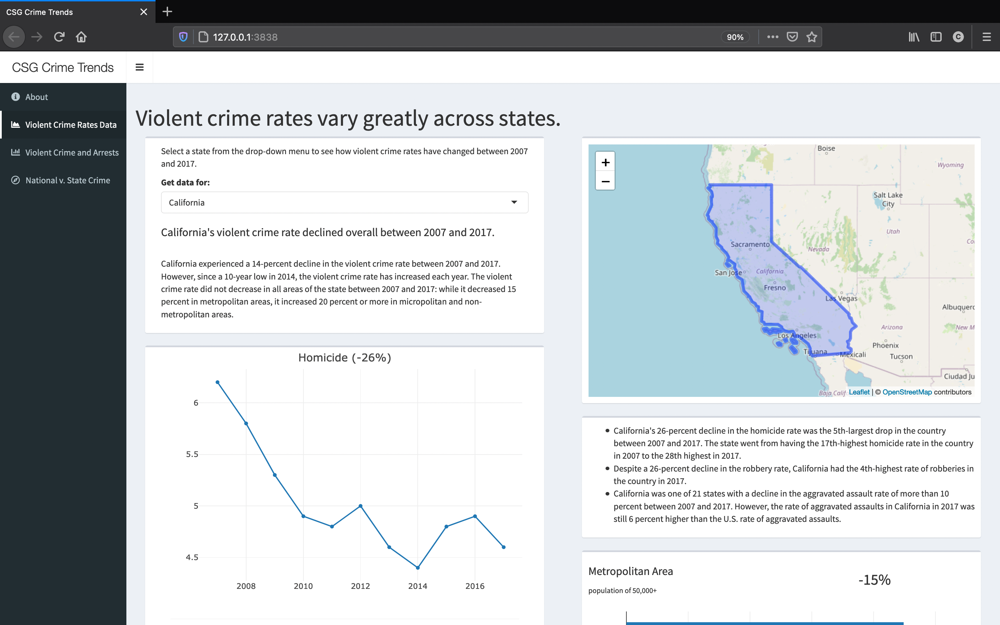
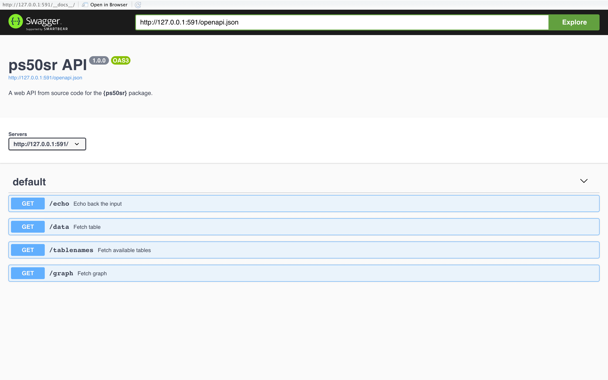

`{ps50sr}`
================

-   [About](#about)
-   [Installation](#installation)
-   [Fetching Data](#fetching-data)
-   [Launching **{shiny}** Apps](#launching-shiny-apps)
-   [Launching **{plumber}** Web API](#launching-plumber-web-api)
-   [Docker Deployment](#docker-deployment)

<!-- badges: start -->

[](https://www.r-project.org/)
[](https://travis-ci.com/cjcallag/ps50sr)
<!-- badges: end -->

## About

**{ps50sr}** is a repository for the applications and tools developed by
this author for an interview with the Council of State Government
Justice Center.

In essence, this package is centered around the data found on the
[“50-State Report on Public Safety”
website](https://50statespublicsafety.us/). The data sets used to create
dynamic visualizations on “Past 1, Strategy 1: Use data to understand
crime trends” was downloaded, reshaped and stored as a portable .sqlite
database to serve as the backbone to this demonstration. For more
information on how the data was procured and saved, please look at the
documentation on the repo: `docs/data-pulling/*`.

## Installation

The R installation can be accomplished using **{remotes}**:

``` r
if(!requireNamespace("remotes")) install.packages("remotes")
remotes::install_github("cjcallag/ps50sr")
```

With the package installed, you can proceed to use the functions either
loading the library (`library(ps50sr)`) or via the namespace
(`escaexplorer::`).

## Fetching Data

Load library:

``` r
library(ps50sr)
```

Once you install and launch the package, you may access to the portable
.sqlite database of state crimes and arrests data as a system file
within **{ps50sr}** package. First, you will need to establish a
connection to this portable database. Note that you will need the
**{RSQLite}** and **{DBI}** packages to establish that connection:

``` r
con <- DBI::dbConnect(drv = RSQLite::SQLite(),
                      ps50sr:::.sys_file("extdata/ps50sr.sqlite"))
```

With the connection established, you may proceed to query data:

``` r
res <- ps50sr::fetch_table(conn = con, table = "arrests", 
                           # Coerce data.frame to data.table by reference
                           dt = TRUE,
                           # Print SQL query to console
                           verbose = FALSE)
head(res)
```

    ##         State Abbrev Variable Value             Type
    ## 1:    Alabama     AL     2007   336 homicide-arrests
    ## 2:     Alaska     AK     2007    39 homicide-arrests
    ## 3:    Arizona     AZ     2007   297 homicide-arrests
    ## 4:   Arkansas     AR     2007    60 homicide-arrests
    ## 5: California     CA     2007  2022 homicide-arrests
    ## 6:   Colorado     CO     2007   109 homicide-arrests
    ##                                                                                               URL
    ## 1: https://50statespublicsafety.us/app/themes/50state/data/arrests-dashboard/homicide-arrests.csv
    ## 2: https://50statespublicsafety.us/app/themes/50state/data/arrests-dashboard/homicide-arrests.csv
    ## 3: https://50statespublicsafety.us/app/themes/50state/data/arrests-dashboard/homicide-arrests.csv
    ## 4: https://50statespublicsafety.us/app/themes/50state/data/arrests-dashboard/homicide-arrests.csv
    ## 5: https://50statespublicsafety.us/app/themes/50state/data/arrests-dashboard/homicide-arrests.csv
    ## 6: https://50statespublicsafety.us/app/themes/50state/data/arrests-dashboard/homicide-arrests.csv

The `fetch_table()` function is essentially a wrapper enabling the user
to query an SQL database. As such, additional arguments can be passed in
order to refine these queries.

``` r
res <- ps50sr::fetch_table(conn = con, table = "arrests", 
                           # Coerce data.frame to data.table by reference
                           dt = TRUE,
                           # Print SQL query to console
                           verbose = FALSE,
                           # Additional query arguments
                           where = "State = 'California' AND Variable = '2017'")

# Remove URL column from print
res[, -c("URL")]
```

    ##         State Abbrev Variable  Value             Type
    ## 1: California     CA     2017   1499 homicide-arrests
    ## 2: California     CA     2017   2561     rape-arrests
    ## 3: California     CA     2017  16942  robbery-arrests
    ## 4: California     CA     2017  88115  assault-arrests
    ## 5: California     CA     2017 212025      drug-arrest
    ## 6: California     CA     2017 666464 non-index-arrest

## Launching **{shiny}** Apps

The **{shiny}** application(s) included in this package can be launched
programmatically using the `launch_app()` function. At this time, the
only valid **{shiny}** application included is `ps50sr-dashboard` which
can be launched like so:

``` r
ps50sr::launch_app(app = "ps50sr-dashboard",
                   use_browser = TRUE)
```



By default the function uses the “0.0.0.0” as the default IPv4 address
and TCP port 3838. However, these parameters can be modified through the
function’s arguments. For more information, look at the documentation,
`?escaexplorer::launch_app`.

## Launching **{plumber}** Web API

In addition to HTML applications, this package contains a web API that
extends the functionality of the functions in this this package.

``` r
ps50sr::launch_api(port = 591, docs = FALSE)
```

With the API running you can visit this URL using a browser or a
terminal to run your R function and get the results. For instance,
<http://localhost:591/echo?msg=hello> will echo back the ‘hello’ message
you provided. Here a Mac terminal is used:

``` bash
curl "http://localhost:591/echo?msg=hello"
 {"msg":["The message is: 'hello'"]}
```

This API extends the functions in the package. For example, you may
query data from the portable database:

``` bash
curl 'http://127.0.0.1:591/data?table=arrests&where=State%20%3D%20%27California%27%20AND%20Variable%20%3D%20%272017%27&dt=true'
  [
    [
      {"State":"California","Abbrev":"CA","Variable":"2017","Value":"1499","Type":"homicide-arrests","URL":"https://50statespublicsafety.us/app/themes/50state/data/arrests-dashboard/homicide-arrests.csv"},
      {"State":"California","Abbrev":"CA","Variable":"2017","Value":"2561","Type":"rape-arrests","URL":"https://50statespublicsafety.us/app/themes/50state/data/arrests-dashboard/rape-arrests.csv"},{"State":"California","Abbrev":"CA","Variable":"2017","Value":"16942","Type":"robbery-arrests","URL":"https://50statespublicsafety.us/app/themes/50state/data/arrests-dashboard/robbery-arrests.csv"},
      {"State":"California","Abbrev":"CA","Variable":"2017","Value":"88115","Type":"assault-arrests","URL":"https://50statespublicsafety.us/app/themes/50state/data/arrests-dashboard/assault-arrests.csv"},
      {"State":"California","Abbrev":"CA","Variable":"2017","Value":"212025","Type":"drug-arrest","URL":"https://50statespublicsafety.us/app/themes/50state/data/arrests-dashboard/drug-arrest.csv"},
      {"State":"California","Abbrev":"CA","Variable":"2017","Value":"666464","Type":"non-index-arrest","URL":"https://50statespublicsafety.us/app/themes/50state/data/arrests-dashboard/non-index-arrest.csv"}
      ]
    ]
```

To interact with the API, enable the Swagger interface like so:

``` r
ps50sr::launch_api(port = 591, docs = TRUE)
```



## Docker Deployment

For the purposes of encapsulating and deploying the **{shiny}** app and
the **{plumber}** api, `Dockerfiles` have been provided under each
directory. In order to run these you may need to clone the repo. Again,
here a Mac terminal is used:

``` bash
git clone https://github.com/cjcallag/ps50sr
```

If you have not, please install [Docker](https://www.docker.com/).

To deploy the **{shiny}** app, navigate to the app folder inside the
`inst` folder and build the Docker image with the `Dockerfile`:

``` bash
cd inst/ps50sr-dashboard/
docker build -t ps50sr-shinyapp .
```

Now run the image:

``` bash
docker run --rm -p 3838:3838 ps50sr-shinyapp
```

The **{plumber}** API can be deployed similarly, like so:

``` bash
cd inst/api/
docker build -t ps50sr-api .
docker run --rm -p 591:591 ps50sr-api
```
